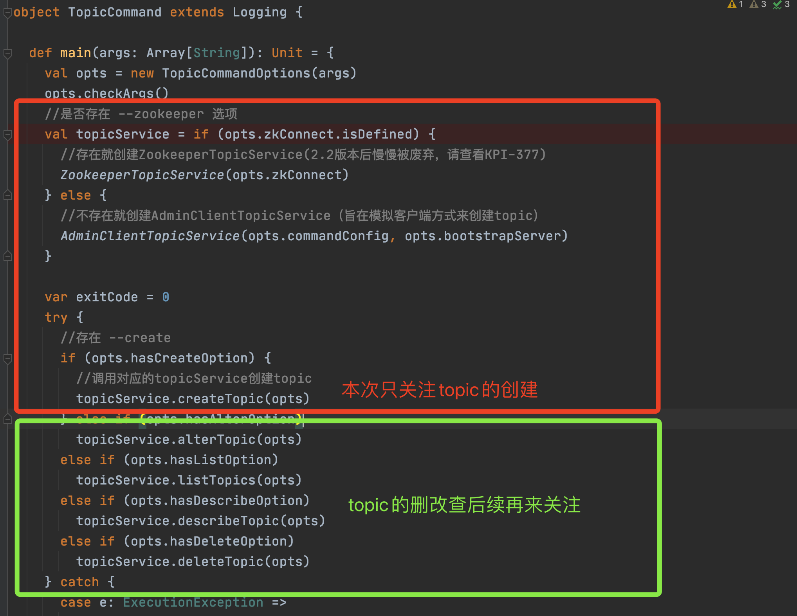
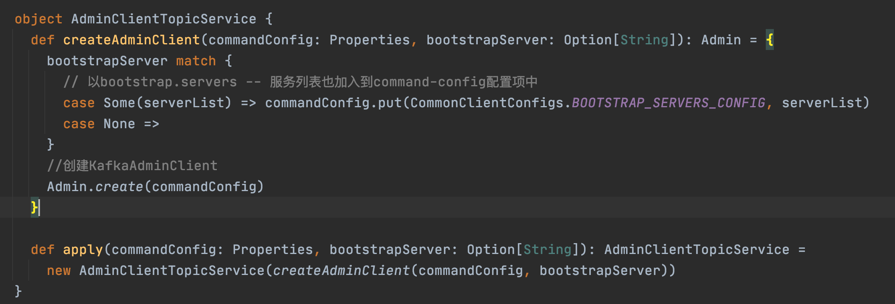

# 一、 topic创建

###  1. topic的创建方式

topic是kafka消息发送的逻辑概念，发送消息之前，需要先创建topic，创建topic有两种方式

（1）使用命令方式，bin/kafka-topics.sh 来创建 （推荐使用）

```shell
bin/kafka-topics.sh --create --zookeeper 192.168.0.2:2181/kafka100 --topic test --replication-factor 1 --partitions 1
```

下面是创建topic所需要的一些参数

| <span style="display:inline-block;width:150px">参数</span>                 | 描述                                                         | 例子                                                         |
| :------------------- | :----------------------------------------------------------- | :----------------------------------------------------------- |
| --bootstrap-server   | 指定连接到的kafka服务; 如果有这个参数,则 --zookeeper可以不需要 | –bootstrap-server localhost:9092                             |
| --zookeeper          | 弃用, 通过zk的连接方式连接到kafka集群;                       | –zookeeper localhost:2181 或者localhost:2181/kafka           |
| --replication-factor | 副本数量,注意不能大于broker数量;如果不提供,则会用集群中默认配置 | –replication-factor 3                                        |
| --partitions         | 分区数量                                                     | 当创建或者修改topic的时候,用这个来指定分区数;如果创建的时候没有提供参数,则用集群中默认值; 注意如果是修改的时候,分区比之前小会有问题 |
| --replica-assignment | 副本分区分配方式;创建topic的时候可以自己指定副本分配情况;    | --replica-assignment BrokerId-0:BrokerId-1:BrokerId-2,BrokerId-1:BrokerId-2:BrokerId-0,BrokerId-2:BrokerId-1:BrokerId-0 ; 这个意思是有三个分区和三个副本,对应分配的Broker; 逗号隔开标识分区;冒号隔开表示副本 |
| --config             | 用来设置topic级别的配置以覆盖默认配置;只在–create 和–bootstrap-server 同时使用时候生效; 可以配置的参数列表请看文末附件 | 例如覆盖两个配置 --config retention.bytes=123455 --config retention.ms=600001 |
| --command-config     | 用来配置客户端Admin Client启动配置,只在–bootstrap-server 同时使用时候生效; | 例如:设置请求的超时时间 --command-config config/producer.proterties; 然后在文件中配置 request.timeout.ms=300000 |
| --create             | 命令方式; 表示当前请求是创建Topic                            | --create                                                     |

> Kafka-copics.sh命令在2.2版本后用--bootstrap-server代替了--zookeeper的方式，旨在隐藏对zk的细节，但是目前--zookeeper依然可以用，可能后续版本就废弃了。详情请查看
>
> https://kafka.apache.org/22/documentation.html
>
> https://cwiki.apache.org/confluence/display/KAFKA/KIP-377%3A+TopicCommand+to+use+AdminClient

该shell脚本源码分析

```shell
# 执行kafka.admin.TopicCommand类
exec $(dirname $0)/kafka-run-class.sh kafka.admin.TopicCommand "$@"
```

（2）生产者在发送消息的时候自动会创建 ==num.partitions==（默认为1）个分区和==default.replication.factor==（默认为1）个副本的topic，前提是kafka配置文件server.properties中的 ==auto.create.topics.enable = true==，生产环境建议设置`auto.create.topics.enable`为`false`（不推荐）

| 配置参数                   | 描述                              | 默认值 | 所在源码文件      |
| -------------------------- | --------------------------------- | ------ | ----------------- |
| num.partitions             | 自动创建topic时，默认创建的分区数 | 1      | KafkaConfig.scala |
| default.replication.factor | 自动创建topic时，默认创建的副本数 |        | KafkaConfig.scala |
| auto.create.topics.enable  | 是否开启自动创建topic             | rue    | KafkaConfig.scala |

### 2. 基于命令创建的源码分析

#### (1) 进入TopicCommand源码分析

​	

源码解释

1. 根据参入参数中是否带有 `--zookeeper` 来判断到底创建哪一种topicService对象，具体，两者的区别不在赘述
2. 根据 `--create` 来判断创建topic

#### (2)  AdminClientTopicService源码分析

由于`--zookeeper`逐渐被废弃，在加上AdminClientTopicService最终也是和ZookeeperTopicService调用到了同个地方，所以我们的目光转移到`AdminClientTopicService`上来



1. 如果有入参`--command-config` ,则将这个文件里面的参数都放到map `commandConfig`里面, 并且也加入`bootstrap.servers`参数
2. 将上面的`commandConfig` 作为入参调用`Admin.create(commandConfig)`创建 `kafkaAdminClient`，这个时候调用的Client模块的代码了, 从这里我们就可以看出，我们调用`kafka-topic.sh`脚本实际上是kafka模拟了一个客户端`Client`来创建Topic

 #### （3）AdminClientTopicService

截图太小，故贴下源码

```java
                                            //该参数包含bootstrap.servers以及command-config
case class AdminClientTopicService private (adminClient: Admin) extends TopicService {

  override def createTopic(topic: CommandTopicPartition): Unit = {
    //如果配置了 --replication-factor ，则副本数不能小于1，并且不能超过32767
    if (topic.replicationFactor.exists(rf => rf > Short.MaxValue || rf < 1))
      throw new IllegalArgumentException(s"The replication factor must be between 1 and ${Short.MaxValue} inclusive")

    //如果配置了--partitions，分区数不能小于0
    if (topic.partitions.exists(partitions => partitions < 1))
      throw new IllegalArgumentException(s"The partitions must be greater than 0")

    try {
      //是否存在副本分配方式
      val newTopic = if (topic.hasReplicaAssignment) {
        //  --replica-assignment 1:3,2:1,3:2
        //  逗号区分不同的partition，冒号区别相同partition中的replication
        new NewTopic(topic.name, asJavaReplicaReassignment(topic.replicaAssignment.get))
      } else {
        //根据 partitions 和  --replication-factor来 创建topic
        new NewTopic(
          topic.name,
          topic.partitions.asJava,
          topic.replicationFactor.map(_.toShort).map(Short.box).asJava)
      }
      //将 --config解析解析成 java map, 可以用来覆盖默认的topic级别的配置
      val configsMap = topic.configsToAdd.stringPropertyNames()
        .asScala
        .map(name => name -> topic.configsToAdd.getProperty(name))
        .toMap.asJava
      newTopic.configs(configsMap)

      //调用 kafkaAdminClient 创建topic，并且设置创建topic失败后不要重试
      val createResult = adminClient.createTopics(Collections.singleton(newTopic),
        new CreateTopicsOptions().retryOnQuotaViolation(false))
      createResult.all().get()
      println(s"Created topic ${topic.name}.")
    } catch {
      case e : ExecutionException =>
        if (e.getCause == null)
          throw e
        if (!(e.getCause.isInstanceOf[TopicExistsException] && topic.ifTopicDoesntExist()))
          throw e.getCause
    }
  }
```


